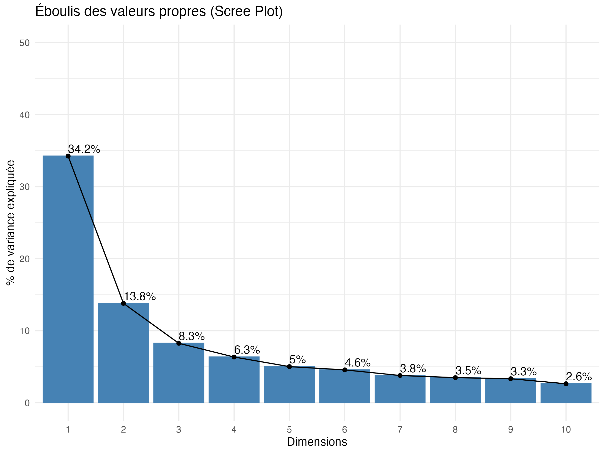
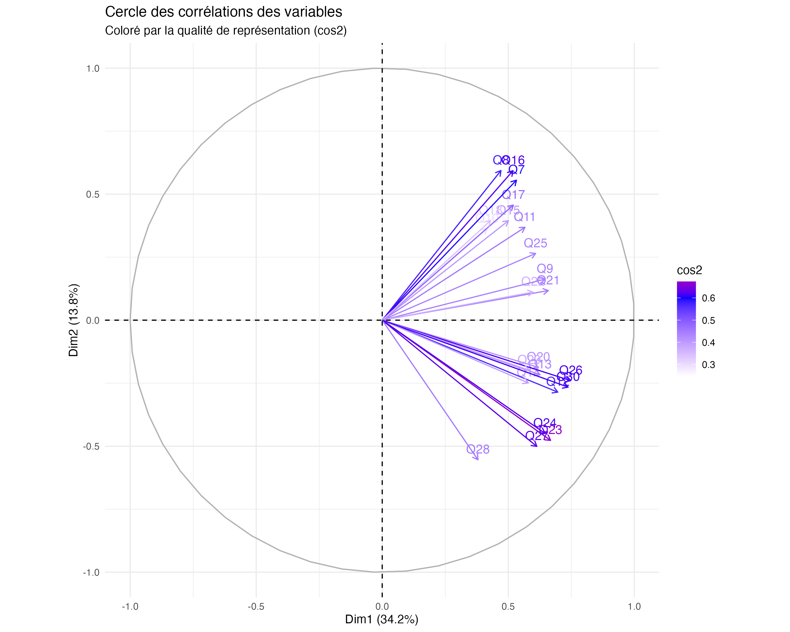
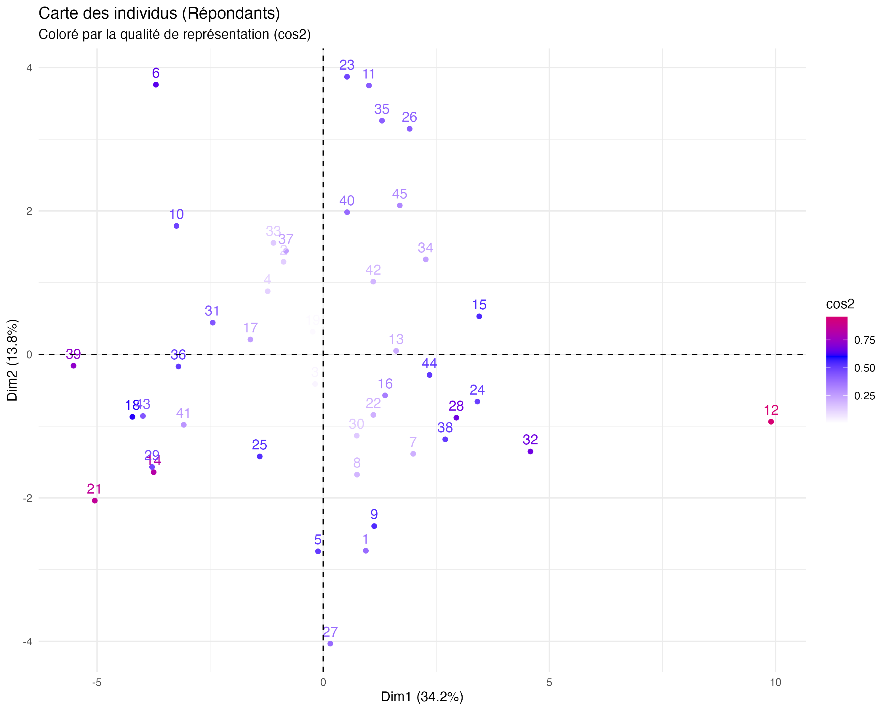
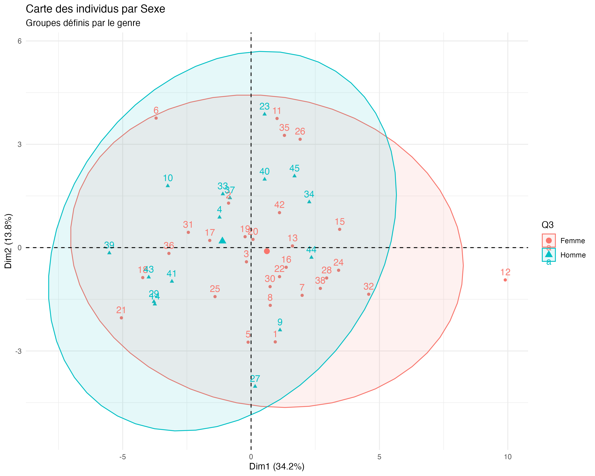
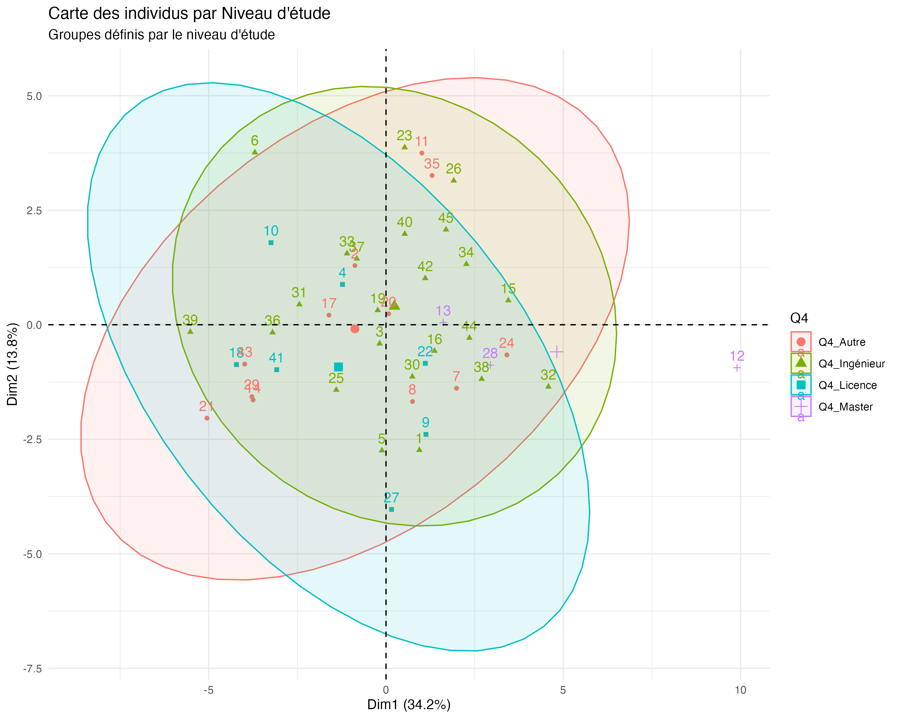

# Rapport d'Analyse en Composantes Principales (ACP)

Ce rapport présente les résultats de l'Analyse en Composantes Principales effectuée sur les données de satisfaction, en suivant la méthodologie du document tutoriel `AD_ACP (1).pdf`.

## 1. Eboulis des valeurs propres
L'éboulis des valeurs propres permet de visualiser la part de variance expliquée par chaque dimension.

- **Dimension 1** : Explique **34.25%** de la variance totale.
- **Dimension 2** : Explique **13.80%** de la variance totale.
- **Cumul** : Les deux premiers axes restituent **48.05%** de l'information contenue dans les données.

## 2. Analyse des Variables (Cercle des Corrélations)
Le cercle des corrélations montre la relation entre les variables et les axes factoriels.

- **Axe 1 (Horizontal)** : Les variables les plus contributrices sont liées à l'impact des recommandations sur le choix final (**Q26**, **Q30**). Cet axe peut être interprété comme l'axe de **"Dépendance aux Recommandations"**.
- **Axe 2 (Vertical)** : Les variables comme **Q8** et **Q16** (pertinence du profil) tirent vers le haut. Cet axe représente la **"Qualité de la Personnalisation"**.

## 3. Analyse des Individus
La carte des individus permet de visualiser la dispersion des répondants.

### Carte Global des Individus

### Analyse par Sexe (Habillage)
En colorant les individus par genre, nous pouvons observer d'éventuels groupements.

### Analyse par Niveau d'étude

## 4. Conclusion et Interprétation
L'analyse montre une forte corrélation entre la perception de la qualité des algorithmes et l'influence réelle sur les habitudes d'achat. Les répondants se situant à droite du graphique sont ceux qui sont les plus influencés par les suggestions personnalisées.
